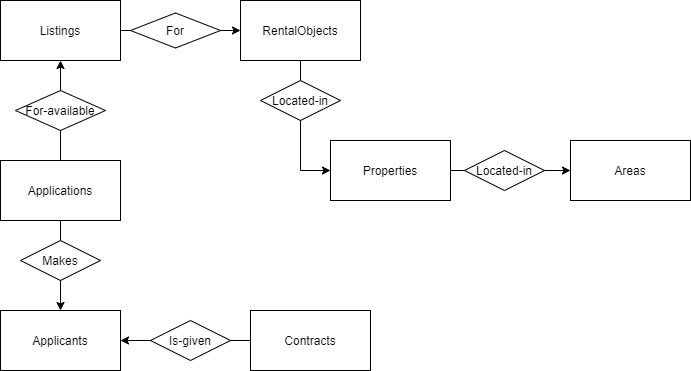

# Simple housing queue system (bostadskö)
## Technical details
 Built with ASP .NET Core 5.0 (MVC), Identity, Entity Framework and Microsoft SQL Server.

## Goal
The idea here is to develop a simple housing queue system. The end-users would be anyone
trying to find an apartment in the city where the housing service is operating.

## Key concepts
### Rental objects
The objects (apartments) that can be rented.
### Property
The property the apartment is located in.
### Area
The area the property is located in.
### Listings
Whenever an apartment is free, there is a listing which contains information related to the apartment and the area it is located in and also when the
application time expires. 
### Application
An application for the apartment (or more specifically the listing) contains information about the listing, the applicant and the
applicant’s number of waiting days (effectively be the waiting list). 

### Contracts
The applicant with the
longest waiting time is awarded a contract, containing information about the applicant, the
apartment and the start date. An applicant can ever only have one active contract.

## Roles
### Applicants 
Applicants should be able to:
* Register in the housing queue
* View apartment listings
* Apply for free apartments
* ...plus more for a future date

### Admins
Admins should be able to:
* Add new apartments (to existing properties, located in existing areas)
* Give contracts to the applicant (automatically selected, with the longest waiting time)
* List all active contracts
* ...plus more for a future date (add new properties to existing areas, add new areas, terminating contracts i.e. evicting tenants, send invoice to all active contracts and more)

## Data
The DBMS used will be Microsoft SQL Server Web (64-bit) 15.0.4003.23.

Preliminarily, the following tables and columns will be used:

### Schemas
* RentalObjects(RentalObjectID [PKEY], PropertyID [FKEY], Rent)

* Properties(PropertyID [PKEY], AreaID [FKEY], StreetAddress, PropertyDescription)

* Areas(AreaID [PKEY], AreaDescription)

* Listings(ListingID [PKEY], ApartmentID [FKEY])

* Applicants(ApplicantID [PKEY], FirstName, LastName, Email, Phone, RegistrationDate)

* Applications(ApplicationID [PKEY], ApplicantID [FKEY], ListingID [FKEY], QueueTime)

* Contracts(ContractID [PKEY], ApplicantID [FKEY], RentalObjectID [FKEY], StartDate, EndDate)

### EF diagram


## Development details
### To do list
#### Implementation
* ~~Add authentication/authorization/Identity~~
* Add all entities and migrate them
* Add bundling/minification?

#### Requirements
* ~~Applicant: Register in the housing queue~~ 
* ~~Applicant: Display available listings~~
* Applicant: Apply for apartments
* Admin: Add new apartments to existing properties
* Admin: Award contracts to the applicant with the longest waiting time
* Admin: List all active contracts

### Raw SQL queries
For this assignment, raw SQL queries will be used instead of LINQ:

```
var blogs = context.Blogs
    .FromSqlRaw("SELECT * FROM dbo.Blogs")
    .ToList();
```
### Migrations
`dotnet ef migrations add InitialCreate`  
`dotnet ef database update`